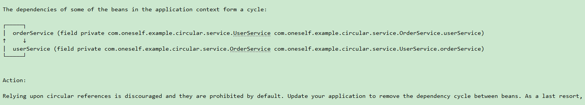

# circular-references
springboot不同版本循环依赖（2.3和2.6）

2.6.13（禁止循环依赖）

>true：允许循环引用；false：不允许循环引用
> 
> spring.main.allow-circular-references=true

2.3.12（允许循环依赖）
如果加入@EnableCircularReferences注解，则允许循环依赖，否则不允许循环依赖
spring.main.allow-circular-references=false 不允许循环依赖